# Cinema Website - Frontend

## Table of Contents

- [Overview](#overview)
- [Features](#features)
- [Technology Stack](#technology-stack)
- [Installation](#installation)
- [Environment Variables](#environment-variables)
- [Project Structure](#project-structure)
- [Pages and Functionality](#pages-and-functionality)
- [Theming](#theming)
- [External API Integration](#external-api-integration)

## Overview

This project is the frontend of a cinema website that allows users to view and book movie tickets online. The platform also includes an admin panel for managing movies, showtimes, and ticket prices.

## Features

### Admin:

- CRUD operations for managing movies, cinemas, halls, and showtimes.
- Viewing statistics for planned sessions.

### User:

- Browse current offers and new movie releases.
- View movie schedules with filters (time, date, genre, etc.).
- View detailed movie information (description, trailers, cast, ratings).
- Register and log in to book tickets.
- View booked tickets.

## Technology Stack

- **Frontend:** Vite, React, TypeScript, MUI, Redux Toolkit
- **Backend:** ASP.NET Web API
- **Database:** PostgreSQL
- **External API:** [The Movie Database (TMDb)](https://developer.themoviedb.org/reference/intro/getting-started)

## Installation

1. Clone the repository:
   ```bash
   git clone https://github.com/CoderPavlo/cine-hub-front.git
   cd cinema-frontend
   ```
2. Install dependencies:
   ```bash
   npm install
   ```
3. Create a `.env` file in the root directory and add the necessary environment variables (see the section below).
4. Start the development server:
   ```bash
   npm run dev
   ```

## Environment Variables

Create a `.env` file in the root directory with the following values:

```
VITE_APP_API_KEY=API_KEY_FOR_THEMOVIEDB
VITE_APP_BASE_URL=https://api.themoviedb.org/3/
VITE_BASE_IMG_URL = https://image.tmdb.org/t/p/
VITE_BASE_URL = https://localhost:7108/
VITE_ACCESS_LIFETIME = 60
VITE_REFRESH_LIFETIME = 10080
```

## Project Structure

```
 cine-hub-front/
 ├── src/
 │   ├── components/   # Reusable components
 │   ├── pages/        # Pages
 │   ├── store/        # Redux store & slices
 │   ├── hooks/        # Custom hooks
 │   ├── models/       # Main interfaces
 │   ├── App.tsx       # Main application file with app routes
 │   ├── main.tsx      # Entry point
 ├── public/           # Static assets
 ├── .env              # Environment variables
 ├── package.json      # Dependencies and scripts
 ├── README.md         # Documentation
```

## Pages and Functionality

### 1. Home Page

- Displays the site’s main functionalities and recommended movies.

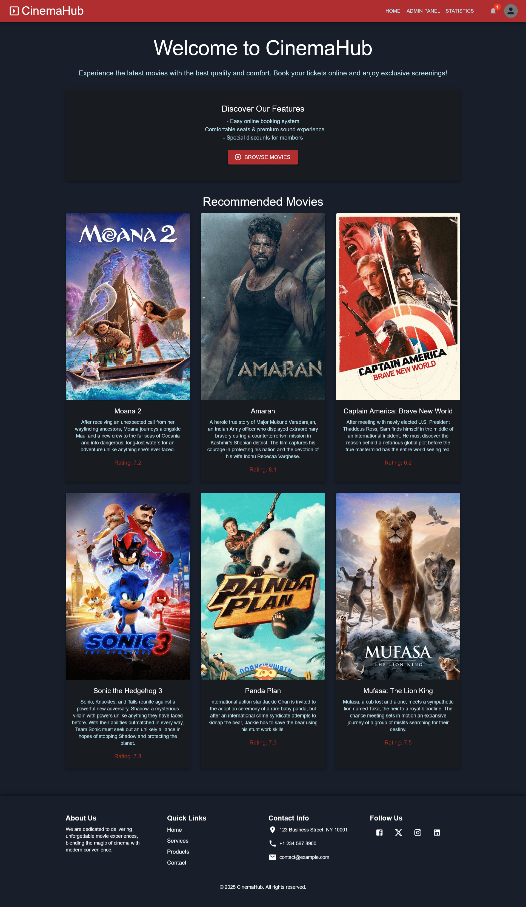

### 2. Login & Registration Page

- Allows users to sign in or create an account to book tickets.

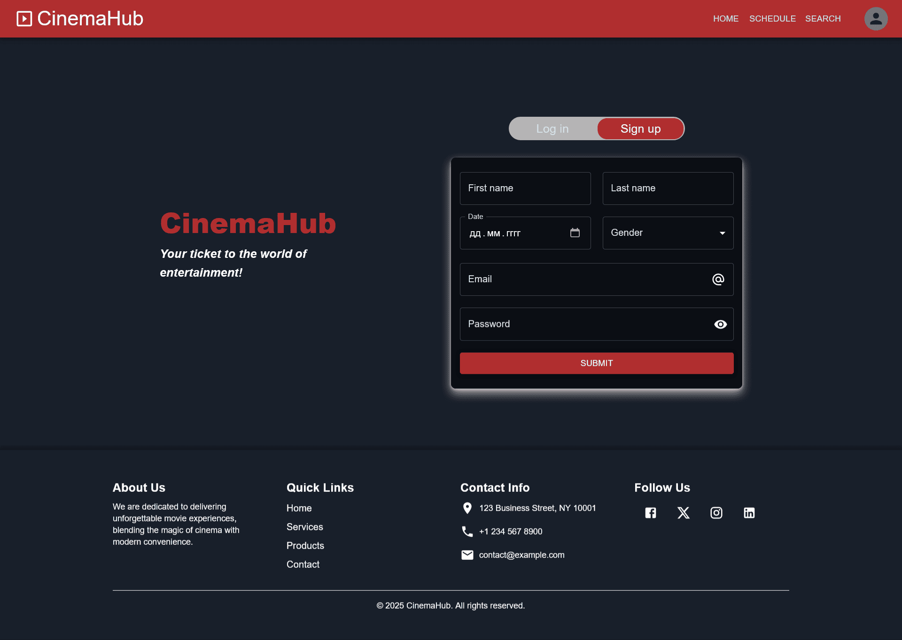

### 3. Movie Schedule Page

- Shows available showtimes with filters for date, cinema, and list or schedule view.


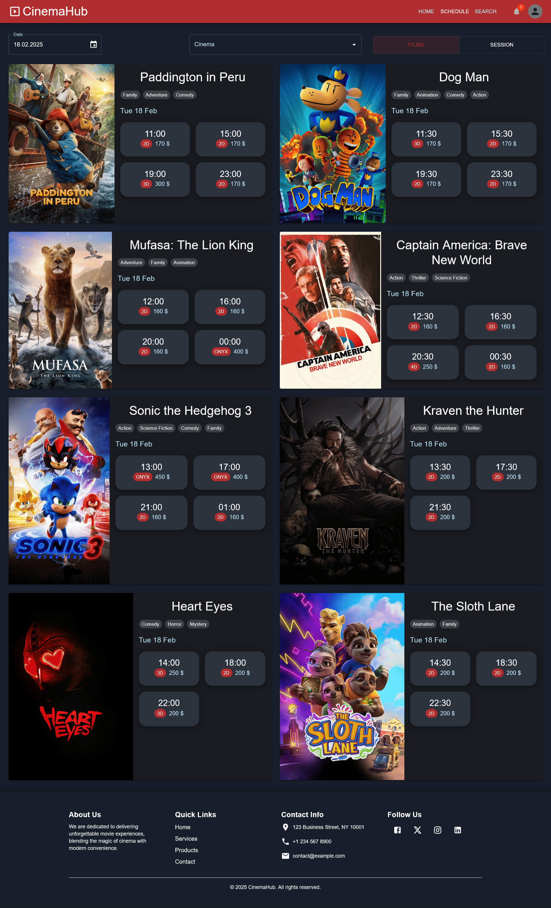

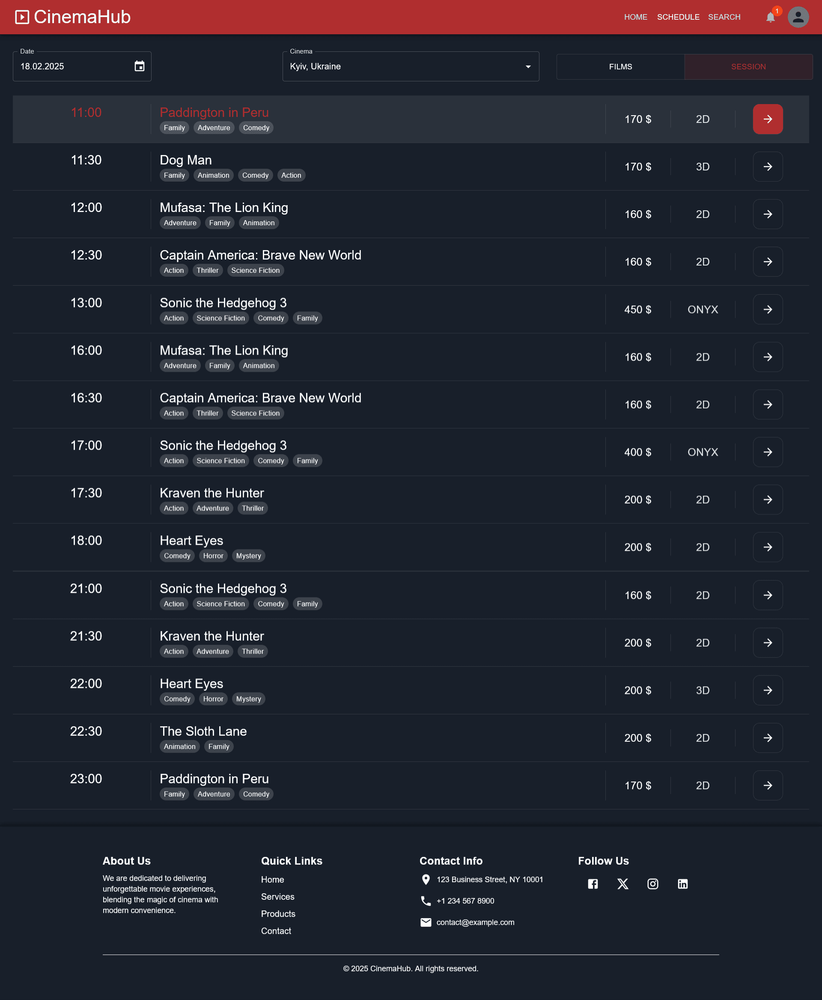

### 4. Movie Search Page

- Allows searching for movies by query, year, and country.

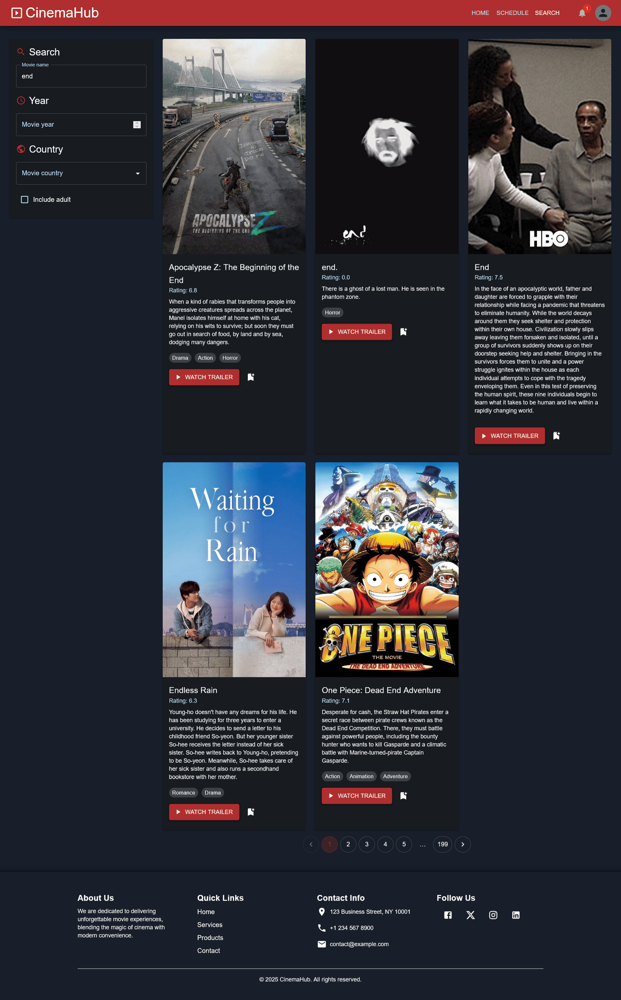

### 5. Movie Details Page

- Displays detailed movie information, including showtimes, cast, ratings, and trailers.

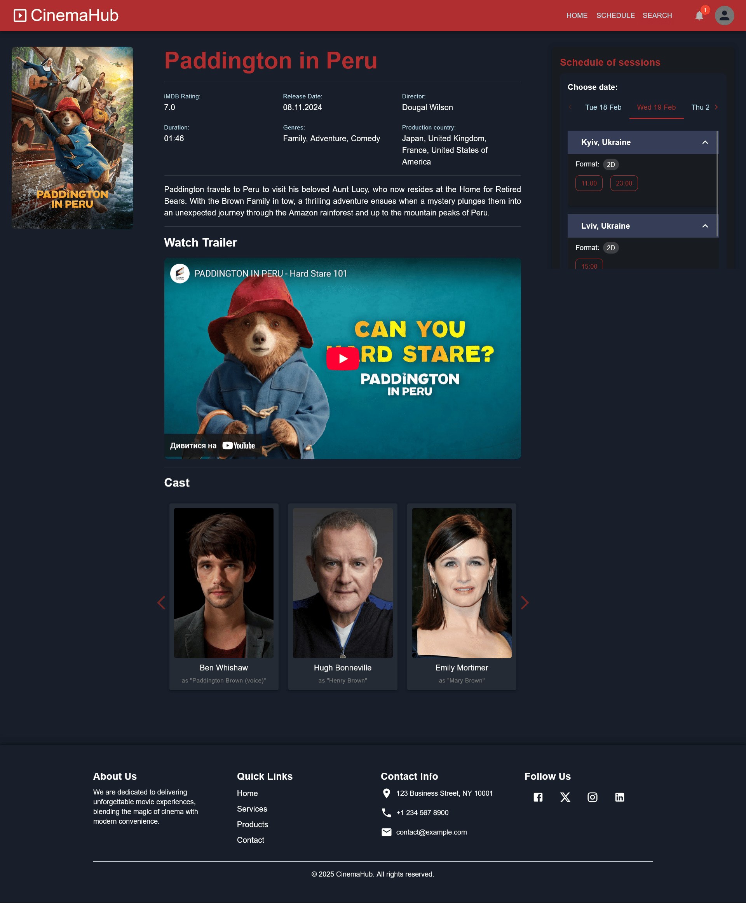

### 6. Ticket Booking Page

- Enables users to book tickets for a selected movie session.

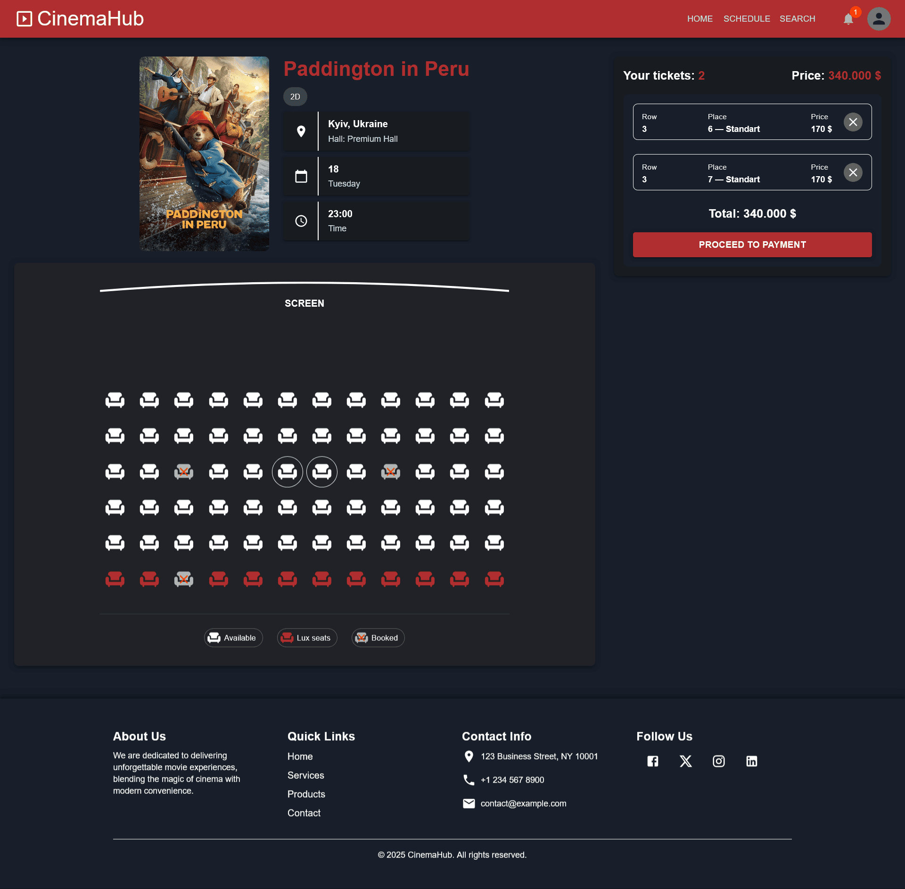

### 7. User Dashboard

- Displays booked tickets, recommended movies, and new releases.

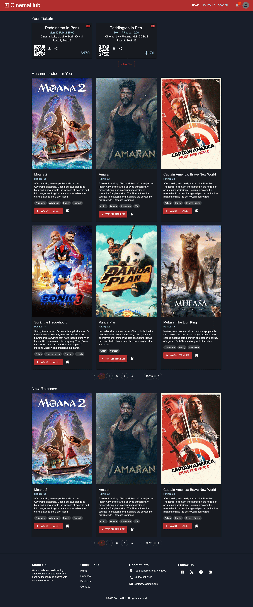

### 8. Tickets Page

- Shows a list of booked tickets.

### 9. Admin Dashboard

- Provides an overview of planned sessions and statistics, with filters for cinema, hall, and date.

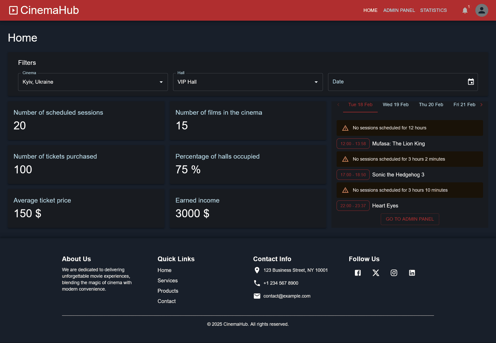

### 10. Admin Panel

- Includes tabs for managing cinemas, halls, and showtimes (CRUD operations).

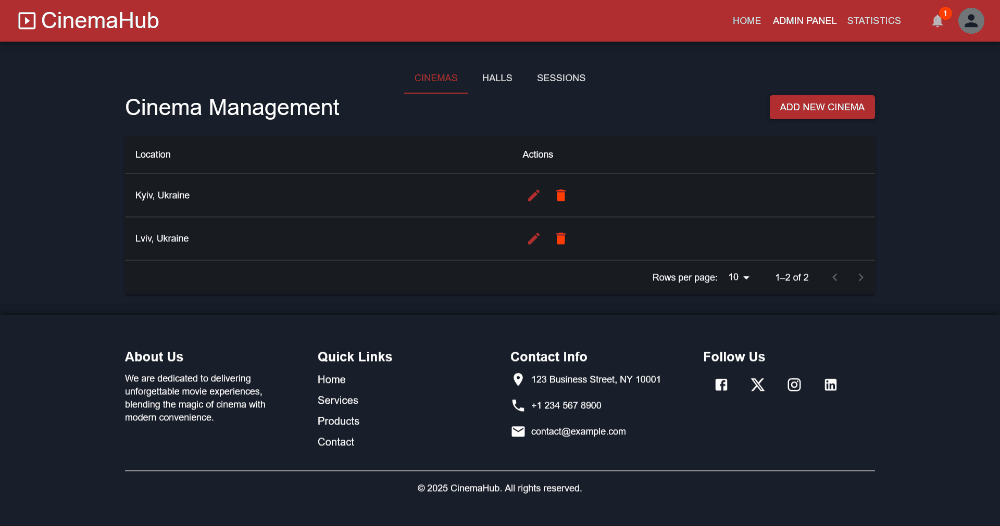

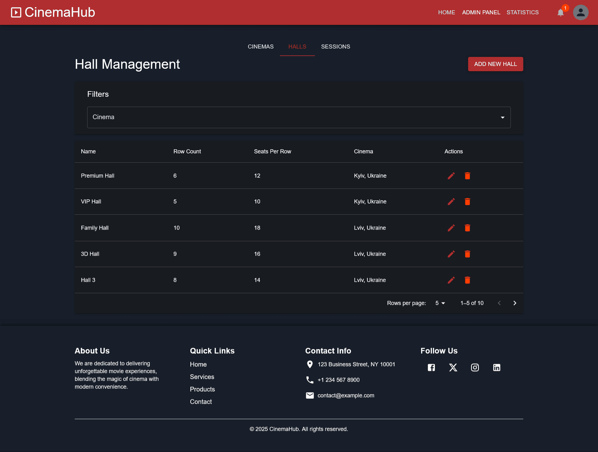

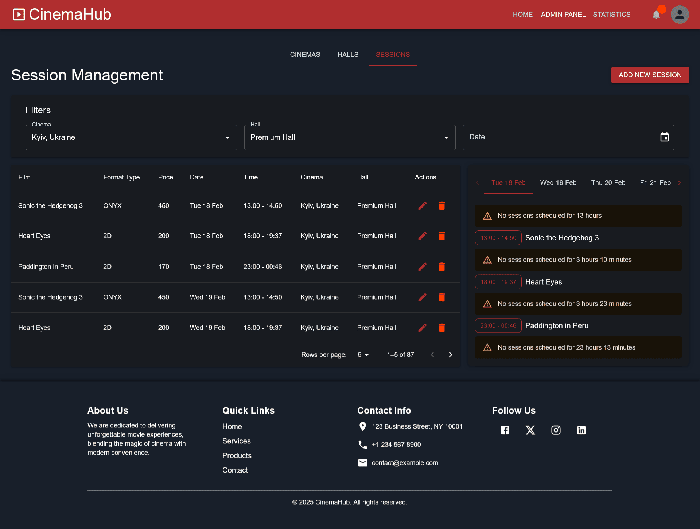

### 11. Statistics Page (In Progress)

- Will display statistical insights about the cinema’s operations.

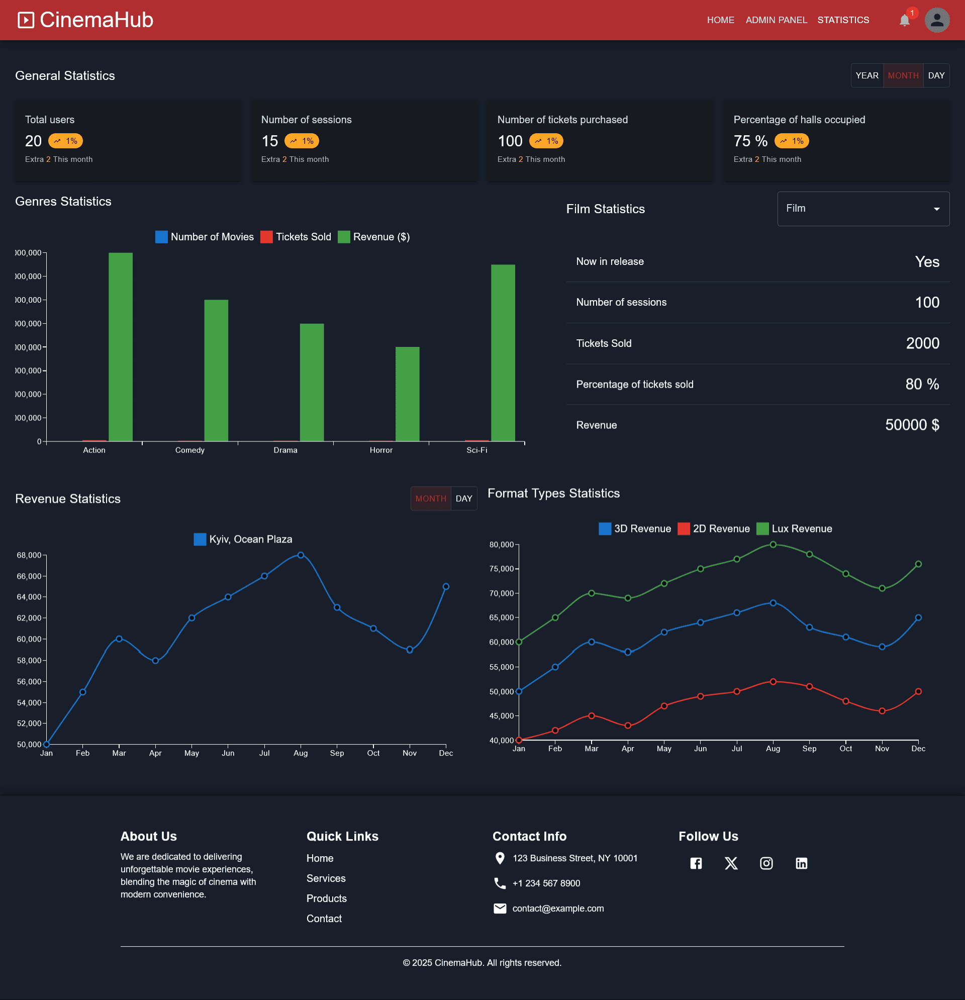

## Theming

The project supports both dark and light themes. Users can switch between themes in the settings.

## External API Integration

The frontend fetches movie data from **The Movie Database (TMDb)** API to provide up-to-date movie details.